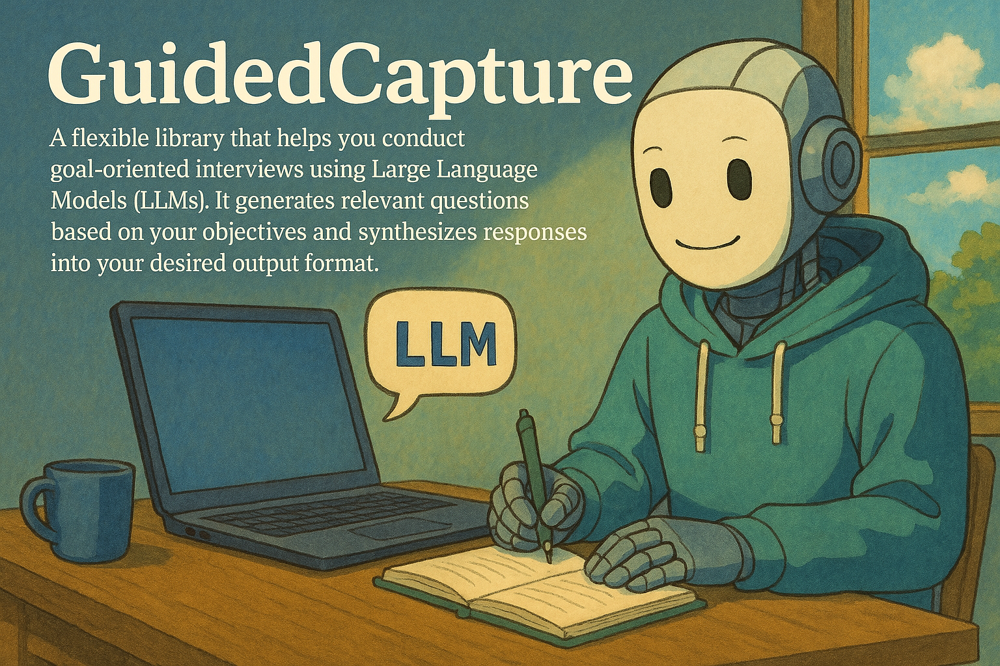

# GuidedCapture

<p align="center">
  
</p>

An AI-powered library for conducting structured interviews and synthesizing responses into desired output formats.

## Overview

GuidedCapture is a flexible library that helps you conduct goal-oriented interviews using Large Language Models (LLMs). It generates relevant questions based on your objectives and synthesizes responses into your desired output format.

### Key Features

- **Goal-Oriented Interviewing**: Start with a clear topic and desired output format
- **LLM-Powered Question Generation**: Automatically generates relevant, probing questions
- **UI-Agnostic Design**: Works with any interface (CLI, web, mobile, etc.)
- **Flexible Answer Collection**: Submit answers progressively or in bulk
- **Intelligent Synthesis**: Processes Q&A pairs into your desired output format
- **State Management**: Save and resume interview sessions
- **Multiple LLM Support**: Works with various LLM providers (OpenAI, Anthropic, etc.)

## Installation

```bash
pip install guided-capture
```

## Quick Start

```python
from openai import OpenAI
from guided_capture import GuidedCapture

# Initialize your LLM client
client = OpenAI(api_key="your-api-key")

# Create a new interview session
capture = GuidedCapture(
    topic="Company Vision",
    output_format_description="A concise company mission statement",
    llm_client=client
)

# Get questions
questions = capture.get_questions()

# Collect answers (example with CLI)
for question in questions:
    print(f"\n{question}")
    answer = input("Your answer: ")
    capture.submit_answer(question, answer)

# Get final output
result = capture.process_answers()
print("\nFinal Output:", result)
```

## UI-Agnostic Design

A key feature of GuidedCapture is its separation of concerns: the library handles question generation and answer processing but leaves the user interaction entirely up to your application. This means you can:

- **Present Questions Your Way**: Show questions in a web form, chat interface, CLI, mobile app, or any other format
- **Collect Answers Your Way**: Accept text input, voice recordings, form submissions, API calls, etc.
- **Control the Flow**: Decide whether to show all questions at once or one at a time
- **Handle Special Cases**: Add your own validation, preprocessing, or transformation of answers

Here are some examples of how you might integrate GuidedCapture with different interfaces:

```python
# Web Form
@app.route('/submit_answer', methods=['POST'])
def submit_answer():
    question = request.form['question']
    answer = request.form['answer']
    capture.submit_answer(question, answer)
    return jsonify({"success": True})

# Voice Interface
def handle_voice_response(audio_input):
    transcribed_answer = speech_to_text(audio_input)
    capture.submit_answer(current_question, transcribed_answer)

# Batch Processing
def process_csv_responses(csv_file):
    answers = {}
    with open(csv_file) as f:
        reader = csv.DictReader(f)
        for row in reader:
            answers[row['question']] = row['answer']
    capture.submit_answers_bulk(answers)
```

This flexibility means GuidedCapture can be integrated into virtually any application that needs structured interviews, regardless of the interface or user experience requirements.

## Advanced Usage

### Bulk Answer Submission

```python
# Submit multiple answers at once
answers = {
    "What is your company's main goal?": "To revolutionize AI accessibility",
    "Who is your target audience?": "Small businesses and startups",
    # ... more answers
}
capture.submit_answers_bulk(answers)
```

### State Management

```python
# Save session state
state = capture.get_state()
import json
with open("session.json", "w") as f:
    json.dump(state, f)

# Load session state
with open("session.json", "r") as f:
    state = json.load(f)
capture = GuidedCapture.load_state(state, llm_client)
```

### Custom Prompts

```python
capture = GuidedCapture(
    topic="Product Features",
    output_format_description="A list of key features",
    llm_client=client,
    question_generation_prompt_template="Custom prompt for questions...",
    synthesis_prompt_template="Custom prompt for synthesis..."
)
```

## Requirements

- Python 3.7+
- OpenAI API key (or other LLM provider credentials)
- Required packages:
  - openai (or other LLM client libraries)
  - typing (included in Python 3.5+)

## Contributing

Contributions are welcome! Please feel free to submit a Pull Request.

## License

MIT License - see LICENSE file for details
